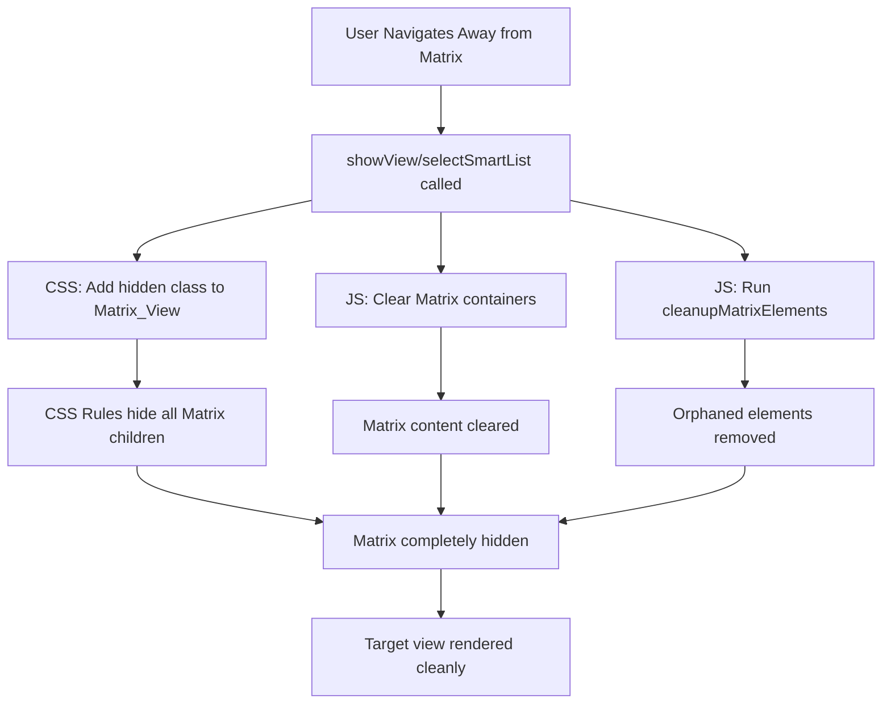

# Design Document: Matrix View Page Isolation Fix

## Overview

This design addresses a page isolation bug where Task Matrix view elements (banner, header, filter bar) incorrectly appear at the bottom of Smart List views when navigating away from the Matrix view. The fix involves strengthening CSS isolation rules, enhancing JavaScript cleanup functions, and ensuring proper DOM containment of Matrix elements.

## Architecture

The fix follows a defense-in-depth approach with three layers of protection:

1. **CSS Layer**: Aggressive hiding rules that ensure hidden views and their children are completely invisible
2. **JavaScript Layer**: Cleanup functions that actively remove orphaned elements and clear containers
3. **DOM Validation Layer**: Runtime checks that verify element containment before rendering



## Components and Interfaces

### 1. CSS Isolation Rules (taskMatrix.css)

Enhanced CSS rules for `#matrix-view.hidden`:

```css
/* Ensure matrix view is completely hidden when not active */
#matrix-view.hidden {
    display: none !important;
    visibility: hidden !important;
    pointer-events: none !important;
    position: fixed !important;
    left: -9999px !important;
    top: -9999px !important;
    width: 0 !important;
    height: 0 !important;
    z-index: -9999 !important;
    opacity: 0 !important;
    overflow: hidden !important;
    contain: strict !important;
}

/* CRITICAL: Ensure all matrix children are hidden when parent is hidden */
#matrix-view.hidden * {
    display: none !important;
    visibility: hidden !important;
    pointer-events: none !important;
}

/* Individual element hiding for extra safety */
#matrix-view.hidden #matrix-banner,
#matrix-view.hidden #matrix-header,
#matrix-view.hidden #matrix-filter-bar,
#matrix-view.hidden #matrix-view-container {
    display: none !important;
    visibility: hidden !important;
    position: absolute !important;
    left: -9999px !important;
}
```

### 2. JavaScript Cleanup Function (app.js)

Enhanced `cleanupMatrixElements()` function:

```javascript
function cleanupMatrixElements() {
    const matrixView = document.getElementById('matrix-view');
    const matrixBanner = document.getElementById('matrix-banner');
    const matrixHeader = document.getElementById('matrix-header');
    const matrixFilterBar = document.getElementById('matrix-filter-bar');
    const matrixContainer = document.getElementById('matrix-view-container');
    
    // CRITICAL: If matrix view is hidden, ensure ALL its elements are hidden and cleared
    if (matrixView && matrixView.classList.contains('hidden')) {
        // Clear all content containers
        [matrixHeader, matrixFilterBar, matrixContainer].forEach(el => {
            if (el) {
                el.innerHTML = '';
                el.style.display = 'none';
                el.style.visibility = 'hidden';
            }
        });
        
        // Hide banner (but don't clear it - it has user settings)
        if (matrixBanner) {
            matrixBanner.style.display = 'none';
            matrixBanner.style.visibility = 'hidden';
        }
    }
    
    // CRITICAL: Remove matrix elements from ALL non-matrix views
    const allViews = document.querySelectorAll('.view:not(#matrix-view)');
    const matrixSelectors = [
        '.kanban-board', '.kanban-column', '.matrix-task-card',
        '.smart-list-view', '.list-task-card', '.dashboard-view',
        '.eisenhower-grid', '.matrix-view-container', '.matrix-banner',
        '.matrix-header', '.matrix-filter-bar', '.matrix-view-switcher',
        '.matrix-header-actions', '.filter-bar', '.filter-chip',
        '.banner-image-container', '.banner-actions'
    ];
    
    allViews.forEach(view => {
        if (!view) return;
        const orphanedElements = view.querySelectorAll(matrixSelectors.join(', '));
        orphanedElements.forEach(el => el.remove());
    });
    
    // CRITICAL: Verify Matrix elements are inside Matrix_View
    [matrixBanner, matrixHeader, matrixFilterBar, matrixContainer].forEach(el => {
        if (el && el.parentElement && el.parentElement.id !== 'matrix-view') {
            el.remove();
        }
    });
}
```

### 3. View Switching Functions (app.js)

Enhanced `showView()`, `selectSmartList()`, and `selectCustomList()` functions with proper cleanup sequencing:

```javascript
function showView(view) {
    // Step 1: Hide ALL views first
    const allViews = ['tasksView', 'habitsView', 'calendarView', 
                      'settingsView', 'pomodoroView', 'statsView'];
    allViews.forEach(v => elements[v]?.classList.add('hidden'));
    
    // Step 2: Hide and clear Matrix view
    const matrixView = document.getElementById('matrix-view');
    if (matrixView) {
        matrixView.classList.add('hidden');
        clearMatrixContainers();
    }
    
    // Step 3: Run cleanup
    cleanupMatrixElements();
    
    // Step 4: Show target view
    // ... rest of switch logic
}

function clearMatrixContainers() {
    const containers = ['matrix-view-container', 'matrix-header', 'matrix-filter-bar'];
    containers.forEach(id => {
        const el = document.getElementById(id);
        if (el) {
            el.innerHTML = '';
            el.style.display = 'none';
        }
    });
    
    const banner = document.getElementById('matrix-banner');
    if (banner) {
        banner.style.display = 'none';
    }
}
```

## Data Models

No new data models are required. The fix operates on existing DOM elements:

| Element ID | Type | Purpose |
|------------|------|---------|
| `matrix-view` | Container | Parent container for all Matrix view content |
| `matrix-banner` | Display | User profile banner with settings |
| `matrix-header` | Navigation | View switcher (Kanban/List/Dashboard) |
| `matrix-filter-bar` | Controls | Filter chips for priority/status/tags |
| `matrix-view-container` | Content | Rendered view content |
| `tasks-view` | Container | Smart List task display |

## Correctness Properties

*A property is a characteristic or behavior that should hold true across all valid executions of a system-essentially, a formal statement about what the system should do. Properties serve as the bridge between human-readable specifications and machine-verifiable correctness guarantees.*

### Property 1: Matrix Child Visibility When Hidden

*For any* Matrix child element (banner, header, filter-bar, container), when Matrix_View has the `hidden` class, the element's computed display style SHALL be `none`.

**Validates: Requirements 1.2, 1.3, 1.4, 1.5**

### Property 2: Tasks_View Isolation Invariant

*For any* navigation sequence ending at a Smart List view, the Tasks_View container SHALL NOT contain any elements with Matrix-specific classes (kanban-board, matrix-task-card, matrix-header, etc.).

**Validates: Requirements 2.1, 2.2, 4.4**

### Property 3: Matrix Element Containment

*For any* Matrix element (banner, header, filter-bar, container) that exists in the DOM, its parentElement SHALL be the Matrix_View element.

**Validates: Requirements 2.4, 5.1, 5.2, 5.3, 5.4**

### Property 4: View Hiding on Switch

*For any* call to `showView(targetView)`, all views except the target view SHALL have the `hidden` class after the function completes.

**Validates: Requirements 4.1**

### Property 5: Matrix Cleanup on List Selection

*For any* call to `selectSmartList()` or `selectCustomList()`, the Matrix containers (header, filter-bar, container) SHALL have empty innerHTML after the function completes.

**Validates: Requirements 4.2, 4.3**

### Property 6: Orphaned Element Removal

*For any* Matrix element placed outside Matrix_View, calling `cleanupMatrixElements()` SHALL result in that element being removed from the DOM.

**Validates: Requirements 4.5, 5.5**

### Property 7: Smart List Navigation Isolation

*For any* navigation from Matrix view to a Smart List view, the visible content SHALL only include Smart List elements and no Matrix elements.

**Validates: Requirements 6.1, 6.2, 6.3, 6.4**

### Property 8: Round-Trip Navigation Consistency

*For any* navigation sequence Matrix → Smart List → Matrix, the Matrix view SHALL render correctly with all components (banner, header, filter-bar, content) visible and functional.

**Validates: Requirements 6.5**

## Error Handling

| Error Scenario | Handling Strategy |
|----------------|-------------------|
| Matrix element not found | Skip cleanup for that element, log warning |
| Parent element is null | Remove orphaned element from DOM |
| View container invalid | Return early from render function |
| CSS rules not applied | JavaScript fallback with inline styles |

## Testing Strategy

### Unit Tests

Unit tests will verify specific examples and edge cases:

1. **CSS Rule Application**: Verify computed styles when hidden class is applied
2. **Container Clearing**: Verify innerHTML is empty after clearMatrixContainers()
3. **Element Removal**: Verify orphaned elements are removed by cleanup function

### Property-Based Tests

Property-based tests will use the `fast-check` library to verify universal properties across many generated inputs:

1. **Navigation Sequence Testing**: Generate random sequences of view navigations and verify isolation properties hold
2. **DOM Manipulation Testing**: Generate random placements of Matrix elements and verify cleanup removes them
3. **Round-Trip Testing**: Generate navigation sequences and verify Matrix renders correctly after returning

**Test Configuration**:
- Minimum 100 iterations per property test
- Each test tagged with: **Feature: matrix-view-isolation-fix, Property {N}: {description}**

### Integration Tests

1. Navigate Matrix → Inbox → verify no Matrix elements visible
2. Navigate Matrix → Today → verify no Matrix elements visible
3. Navigate Matrix → Custom List → verify no Matrix elements visible
4. Navigate Matrix → Smart List → Matrix → verify Matrix renders correctly
5. Rapid navigation between views → verify no content bleeding
