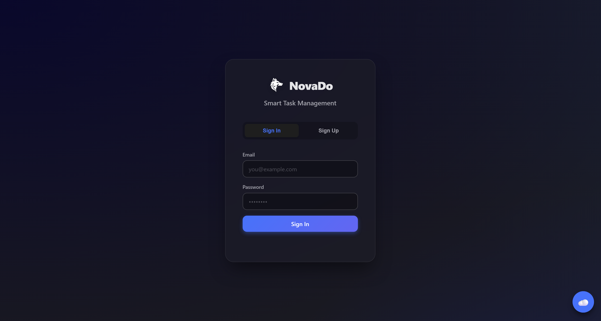
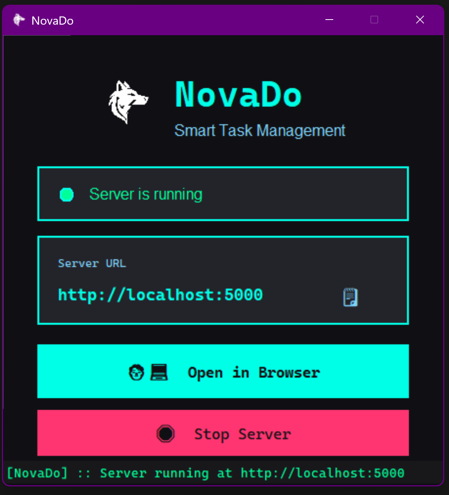
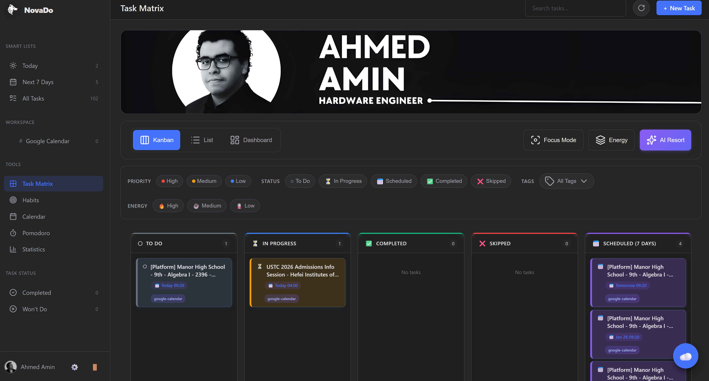
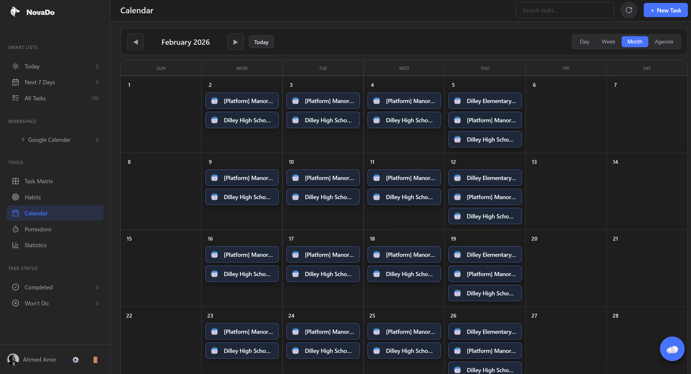
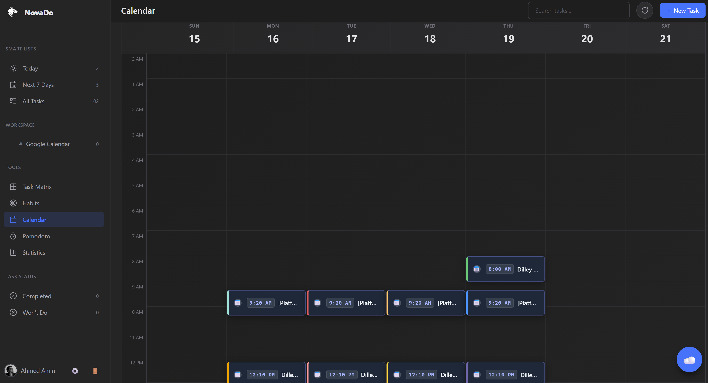
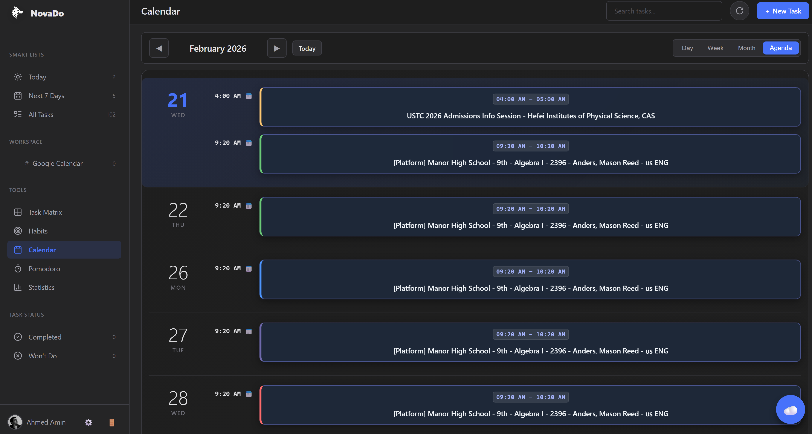
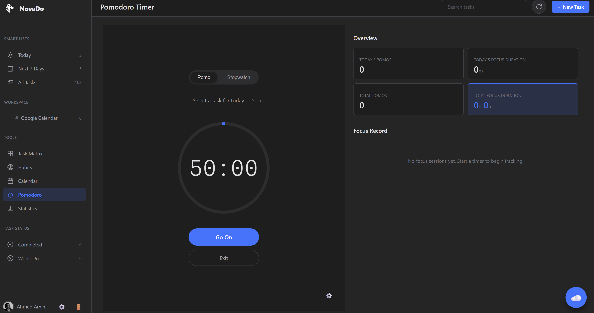
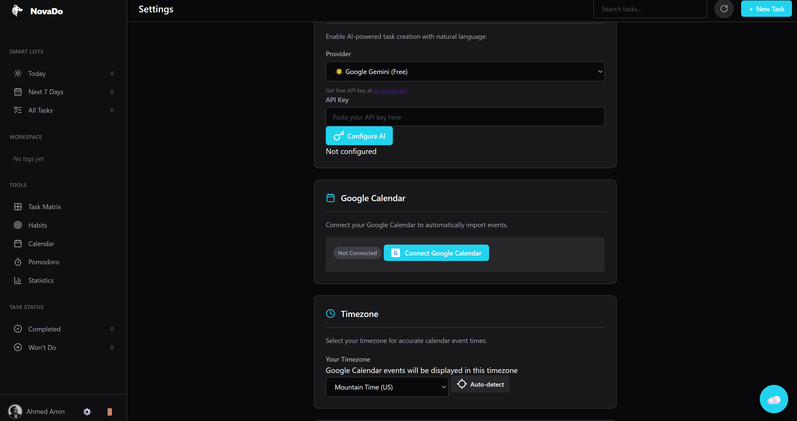

<div align="center">

# NovaDo

### Smart Task Management with AI & Google Calendar Integration

[](https://github.com/amnxlab/NovaDo/releases)
[](LICENSE)
[](https://www.python.org/downloads/)
[](https://github.com/amnxlab/NovaDo)


**[Features](#features) • [Quick Start](#quick-start) • [Documentation](#documentation) • [Screenshots](#screenshots) • [Contributing](#contributing)**

</div>

---

## Overview

NovaDo is a powerful, privacy-focused task management application that combines the simplicity of traditional to-do lists with advanced productivity features. Built for individuals who value both functionality and data ownership.

**Why NovaDo?**
- **Privacy First** – Your data stays on your machine
- **AI-powered** – Natural language task creation
- **Bidirectional Sync** – Full two-way sync with Google Calendar (create/update/delete syncs both directions)
- **Visual Organization** – Eisenhower Matrix & Kanban boards
- **Habit Building** – Track streaks and build consistency
- **Beautiful UI** – 12 professionally designed themes
- **Blazing Fast** – Built with FastAPI & vanilla JavaScript

---

## Features

### Task Management
- **Smart Task Creation** – AI-powered natural language parsing
- **Rich Task Properties** – Priorities, tags, due dates, subtasks, attachments
- **Flexible Views** – List, Matrix (Eisenhower), Kanban, Calendar
- **Advanced Filtering** – Multi-criteria search and smart lists
- **Drag & Drop** – Intuitive task organization

### Calendar Integration
- **Google Calendar Sync** – **Bidirectional (two-way) synchronization** (create/update/delete syncs both directions)
- **Multi-Calendar Support** – Sync multiple calendars simultaneously
- **4 View Modes** – Month, Week, Day, Agenda
- **Timezone Aware** – Accurate handling across timezones
- **Visual Drag & Drop** – Reschedule tasks effortlessly

### AI Assistant
- **3 AI Providers** – Google Gemini, Groq, OpenAI
- **Natural Language** – "Meeting with John tomorrow at 3pm"
- **Smart Suggestions** – AI-powered task recommendations
- **Chat Interface** – Get productivity advice

### Analytics & Insights
- **Comprehensive Statistics** – Tasks, habits, focus sessions
- **Visual Charts** – Trends, completion rates, productivity scores
- **Habit Tracking** – Streak calculation and consistency monitoring
- **Focus Time** – Pomodoro session analytics

### Customization
- **12 Themes** – Professional, carefully crafted color schemes
- **Dark & Light Modes** – Including Hacker, Ocean, Nordic, and more
- **Custom Banners** – Personalize your workspace
- **Flexible Layout** – Adjust to your workflow

### Security & Privacy
- **Local-First** – Data stored on your machine (Mongita database)
- **JWT Authentication** – Secure session management
- **No Cloud Lock-in** – Full data ownership
- **Optional Cloud Sync** – Use Google Calendar when you want

---

## Quick Start

### Download & Install (Windows)

<div align="center">

### NovaDo v1.0.0-beta

[](https://raw.githubusercontent.com/amnxlab/NovaDo/main/releases/NovaDo-v1.0.0.zip)

**Windows 10/11 • 22.7 MB • No installation required**

<div align="left" style="display:inline-block; text-align:left; margin-top:12px; max-width:640px;">

**Quick Setup**
<ol style="list-style-position: inside; padding-left: 0; margin: 0;">
  <li><strong>Download</strong> the file above</li>
  <li><strong>Extract</strong> to any folder (e.g., <code>C:\NovaDo</code> or <code>Desktop\NovaDo</code>)</li>
  <li><strong>Run</strong> <code>NovaDo.exe</code> — that's it!</li>
</ol>

**Features:** Privacy-first • AI-powered • Google Calendar sync • Beautiful UI

<p style="margin-top:8px;">The application will start automatically and open at <code>http://localhost:5000</code></p>

</div>

</div>

---

### Run from Source

```bash
# Clone repository
git clone https://github.com/amnxlab/NovaDo.git
cd NovaDo

# Create virtual environment
python -m venv venv

# Activate virtual environment
# Windows:
.\venv\Scripts\Activate.ps1
# macOS/Linux:
source venv/bin/activate

# Install dependencies
pip install -r requirements.txt

# Run application
python launcher_gui.py    # With GUI launcher
# OR
python main.py            # Direct server start
```

The application will open automatically at `http://localhost:5000`

---

## ⚙️ Configuration

### Basic Setup

1. Copy the environment template:
   ```bash
   cp env.example .env
   ```

2. Edit `.env` with your preferences:

```ini
# Security (Required - Change these!)
SECRET_KEY=your-secret-key-here
JWT_SECRET_KEY=your-jwt-secret-here

# AI Assistant (Optional - Choose one)
GEMINI_API_KEY=your-gemini-key          # Free tier available
GROQ_API_KEY=your-groq-key              # Free tier available
OPENAI_API_KEY=your-openai-key          # Paid

# Google Calendar Sync (Optional)
GOOGLE_CLIENT_ID=your-client-id
GOOGLE_CLIENT_SECRET=your-client-secret
GOOGLE_REDIRECT_URI=http://localhost:5000/api/calendar/callback

# Server Settings
HOST=0.0.0.0
PORT=5000
```

### Getting API Keys

- **Google Gemini**: [Get Free Key](https://makersuite.google.com/app/apikey)
- **Groq**: [Get Free Key](https://console.groq.com/)
- **OpenAI**: [Get API Key](https://platform.openai.com/api-keys)
- **Google Calendar**: [Setup OAuth](https://console.cloud.google.com/)

---

## Documentation

Comprehensive documentation is available in the [`docs/`](docs/) directory:

### Core Documentation
- **[Documentation Index](docs/DOCUMENTATION_INDEX.md)** – Complete navigation guide to all documentation
- **[Features Guide](docs/FEATURES.md)** – Complete feature catalog with usage instructions (14 categories, 100+ features)
- **[API Reference](docs/API_REFERENCE.md)** – REST API specification with all 50+ endpoints
- **[Developer Guide](docs/DEVELOPER_GUIDE.md)** – Setup, architecture, and contribution guide

### Additional Resources
- **[Changelog](CHANGELOG.md)** – Version history and release notes
- **[Contributing Guide](CONTRIBUTING.md)** – How to contribute to NovaDo

---

## Screenshots

<details>
<summary>Click to view screenshots</summary>

### Sign up / Sign in

*Create or sign in quickly with a simple, secure flow.*

### Main App Window

*Overview of the main workspace and navigation.*

### Task Matrix View

*Eisenhower-style matrix for prioritizing tasks.*

### Calendar View (Month/Week/Day)

*Integrated calendar with drag & drop scheduling.*

### Week View

*Compact week-focused scheduling and task planning.*

### Agenda View

*Daily agenda for quick overviews and planning.*

### Pomodoro / Focus Session

*Built-in Pomodoro timer for focused work sessions.*

### Google Calendar Settings

*Configure calendar sync and select which calendars to sync.*

</details>

---

## Tech Stack

**Backend**
- [FastAPI](https://fastapi.tiangolo.com/) – Modern Python web framework
- [Mongita](https://github.com/scottrogowski/mongita) – Embedded MongoDB-compatible database
- [Pydantic](https://pydantic-docs.helpmanual.io/) – Data validation
- [JWT](https://jwt.io/) – Authentication

**Frontend**
- Vanilla JavaScript (ES6+)
- HTML5 & CSS3 with CSS Variables
- [Lucide Icons](https://lucide.dev/) – Beautiful icon library
- No framework dependencies – Fast and lightweight

**AI Integration**
- Google Gemini API
- Groq API
- OpenAI API

**External Services**
- Google Calendar API
- Web Push Notifications (VAPID)

---

## Project Structure

```
NovaDo/
├── app/                      # Backend application
│   ├── routes/               # API endpoints
│   │   ├── auth.py              # Authentication
│   │   ├── tasks.py             # Task management
│   │   ├── calendar.py          # Google Calendar sync
│   │   ├── llm.py               # AI integration
│   │   └── ...
│   ├── models.py                # Data models
│   ├── database.py              # Database connection
│   └── auth.py                  # JWT handling
│
├── static/                   # Frontend assets
│   ├── index.html               # Main application
│   ├── css/                  # Stylesheets
│   │   ├── style.css            # Main styles
│   │   ├── taskMatrix.css       # Matrix view
│   │   └── themes.css           # Theme definitions
│   └── js/                   # JavaScript modules
│       ├── app.js               # Core application
│       ├── api.js               # API client
│       ├── taskMatrix.js        # Matrix logic
│       └── statistics.js        # Analytics
│
├── docs/                     # Documentation
│   ├── FEATURES.md
│   ├── API_REFERENCE.md
│   ├── DEVELOPER_GUIDE.md
│   └── ...
│
├── data/                     # Local database storage
├── uploads/                  # User file uploads
├── main.py                      # Application entry point
├── launcher_gui.py              # GUI launcher
└── requirements.txt             # Python dependencies
```

---

## Requirements

**For Running from Source:**
- Python 3.10 or higher
- pip (Python package manager)
- Virtual environment (recommended)

**For Windows Executable:**
- Windows 10 or higher
- No additional software required

**Optional:**
- Internet connection (for AI features & Google Calendar sync)
- Google account (for calendar integration)
- AI API keys (for natural language processing)

---

## Contributing

We welcome contributions from the community! Whether it's:

- 🐛 Bug reports
- 💡 Feature requests
- 📝 Documentation improvements
- Code contributions

Please see our [Contributing Guide](CONTRIBUTING.md) for details.

### Development Setup

```bash
# Fork and clone
git clone https://github.com/YOUR_USERNAME/NovaDo.git
cd NovaDo

# Install dev dependencies
pip install -r requirements-dev.txt

# Run tests
pytest

# Format code
black .

# Lint
flake8
```

---

## Roadmap

### Version 1.1 (Q2 2026)
- [ ] Mobile apps (iOS & Android)
- [ ] Recurring tasks
- [ ] Task templates
- [ ] Advanced automation rules
- [ ] Team collaboration features

### Version 1.2 (Q3 2026)
- [ ] Desktop apps (Electron)
- [ ] Integrations (Slack, Notion, Todoist)
- [ ] Custom widgets
- [ ] Advanced reporting
- [ ] Data export/import improvements

### Future Considerations
- Plugin system
- Public API
- Cloud sync option (optional)
- Multi-language support

See [ROADMAP.md](ROADMAP.md) for detailed plans.

---

## License

NovaDo is open source software licensed under the [MIT License](LICENSE).

```
MIT License

Copyright (c) 2026 Ahmed Amin

Permission is hereby granted, free of charge, to any person obtaining a copy
of this software and associated documentation files (the "Software"), to deal
in the Software without restriction, including without limitation the rights
to use, copy, modify, merge, publish, distribute, sublicense, and/or sell
copies of the Software...
```

---

## Author

**Ahmed Amin**

- Website: [amnxlab.site](https://amnxlab.site)
- GitHub: [@amnxlab](https://github.com/amnxlab)
- Email: contact@amnxlab.site

---

## Acknowledgments

- FastAPI team for the amazing framework
- Mongita for the embedded database
- Lucide for beautiful icons
- Google for Gemini AI and Calendar API
- The open source community

---

## Star History

If you find NovaDo useful, please consider giving it a star! It helps others discover the project.

[](https://star-history.com/#amnxlab/NovaDo&Date)

---

<div align="center">

**[⬆ Back to Top](#novado)**

Made with ❤️ by [Ahmed Amin](https://amnxlab.site)

**NovaDo v1.0.0-beta** • Released January 2026

</div>
